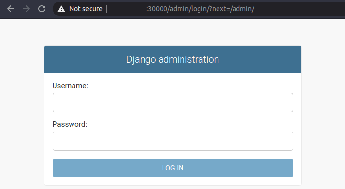
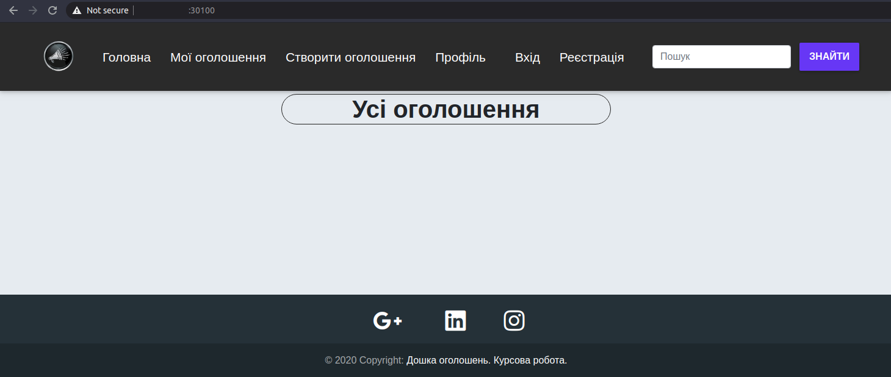

# Deploy [Callboard](https://github.com/Vetal-V/Coursework-DS) to Kubernetes

## Pre Requirements
- Terraform
- Ansible
- Account Azure and Azure CLI (az)
- Docker

## Configure Kuberneter cluster
1. Get Azure login credentials:
    - login via web page:
        ```
        az login
        ```
    - save value `id` and run command replacing the value of `SUBSCRIPTION_ID` with `id`:
        ```
        az ad sp create-for-rbac --role="Contributor" --scopes="/subscriptions/SUBSCRIPTION_ID"
        ```
    - now `id` is `subscription_id`, `appId` - `client_id`, `password` - `client_secret` and `tenant` - `tenant_id`.
  
2. Create file `./terraform/variables.tf` with the following content:
    ```
    variable "instance_count" {
    default = "3"
    }

    variable "location" {
        default = "eastus"
    }

    variable "subscription_id" {
        default = "YOUR_SUBSCRIPTION_ID"
    }

    variable "client_id" {
        default = "YOUR_CLIENT_ID"
    }

    variable "client_secret" {
        default = "YOUR_CLIENT_SECRET"
    }

    variable "tenant_id" {
        default = "YOUR_TANANT_ID"
    }

    variable "admin_username" {
        default = "ubuntu"
    }

    variable "admin_password" {
        default = "YOUR-STRONG-PASSWORD"
    }
    ```
3. Init terraform and download cloud dependencies:
    ```
    cd terraform
    terraform init
    ```
4. Apply the terraform changes required to reach the desired state of the configuration:
   ```
   terrform apply
   ```
5. Run script `./setup_ansible.sh` to configure Ansible hosts file:
   ```
   cd ../ansible/
   chmod +x setup_ansible.sh
   ./setup_ansible.sh
   ```
6. Configure Kubernetes cluster:
   ```
   ansible-playbook -i hosts -u ubuntu main.yml
   ```
7. Deploy callboard to k8s:
   1. Run deploy with rebuild docker images:
      - Set dependencies for Django admin user (this value for example) and name of Docker Hub repository:
           ```
           export ADMIN_USERNAME=admin
           export ADMIN_PASSWORD=adminpass
           export ADMIN_EMAIL=admin@test.com
           export DOCKER_REPO=vetalvr/callboard-kube
           ```
      - Deploy Backend(Django) and Frontend(Vue.js):
           ```
           chmod +x rebuild_deploy.sh
           ./rebuild_deploy.sh
           ```
   2. Run deploy without rebuild docker images:
        ```
        chmod +x no_rebuild_deploy.sh
        ./no_rebuild_deploy.sh
        ```
8. To check the launch of backend you need to follow the link `GLOBAL_IP`:30000/admin (global ip of any machine, for example from file `hosts`):

9.  To check the launch of frontend you need to follow the link `GLOBAL_IP`:30100 (global ip of any machine, for example from file `hosts`)



ssh -i ./kubernetes-key.pem ubuntu@3.140.18.0


[main]
MAIN_IP ansible_user=USERNAME ansible_password=PASSWORD

[worker]
WORKER_IP ansible_user=USERNAME ansible_password=PASSWORD 

[all:vars]
ansible_python_interpreter=/usr/bin/python3


docker build -t vetalvr/callboard-kube:django -f Dockerfile_django .
docker build -t vetalvr/callboard-kube:vue-front_v1 -f Dockerfile_front .

#!/bin/bash

sshpass -p PASSWORD ssh ubuntu@MAIN_IP "kubectl apply -f /home/ubuntu/.kube/deploy/"
